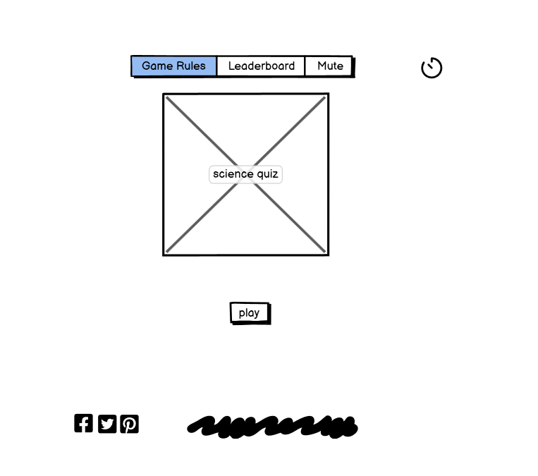
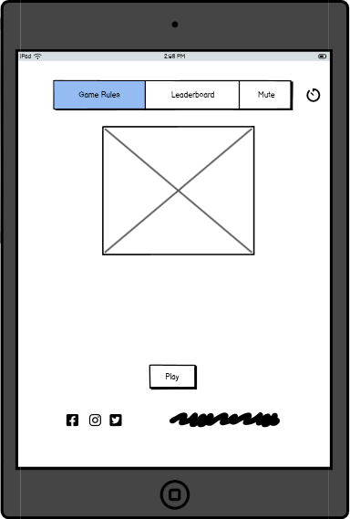

#                                  **Quiz-game1**
# Interactive Front-End Development Project using HTML,CSS and Javascript

#                                      James cutmore Quiz-game1-2022-MS2
A live website can be found [here](https://8000-jamesrcutmore-quizgame1-obvra4pp504.ws-eu92.gitpod.io//)
## **Table of Contents**

- [About](#About)
- [Users Experience(UX)](<#users-experience(ux)>)
  - [Project Goals](#project-goals)
  - [Target Audience](#target-audience)
  - [User Stories](#user-stories)
  - [Design](#design)
  - [Wireframe](images/2022-09-18%20(2).jpg)
- [Features](#Features)
  - [Existing Features](#existing-features)
  - [Features Left to Implement](#features-left-to-implement)
- [Technologies-Used](#Technologies-Used)
- [Testing](#Testing)
- [Deployment](#Deployment)
- [Credit](#Credit)
  - [Content](#content)
  - [Media](#media)
  - [Acknowledgements](#acknowledgements)

## **About**

Everyone loves a quiz?! They fun way to fill your spare time and keep you and your family entertained!

This quiz in perticular is based on the web development, how much do you really know? Take a little time complete the quiz, and you will find out!

This Quiz is designed to include a wide range of randomised questions about all types of web development basics. So by building the site and my read.me ive renforced my knowledge, and you can too, each game has 10 random questions, At the end , you will get your score and the chance to try again.. Have fun!

## **Users Experience (UX)**

### **Project Goals**

- The primary goal of this project is to set up a quiz game or knowledge checker ,for the players that may become a brief assessment to measure their knowledge in HTML&CSS.

- The secondary goal is to help the user get their thinking mind on,improve short-term memory and sharpen their knowledge of the subject.

### **Target Audience**

- This quiz is aimed at any age bracket or audience.

- With todays online markets growing, and the world of internet ever exspanding.They will be a greater demand for web developers so lets have a quiz about this subject and encourage people to study this subject.

- The best way to promote our quiz game is through online advertisements and social media shares.

### **Uers Stories**

- **General User Goals**

  - As a Quiz lover, I want to find quiz related activities, so that it broadens my knowledge and understanding.

  - As an inquisitive person, I want to find a quiz, so that I can have fun and learn with.

  - As a Quizzer, I want to find interesting games, so that I can spend time, and enjoy enjoying playing them.

  - As a learner , I want to learn through games, so that I can gain knowledge and idea's.

  - As a person who likes to be challenged, I want to find a challenging Quiz, so that I can test myself.

  - As a Quiz competitor, I want to beat my last score ,when it is shown at the end.

  - As a I-phone user, I want an app that is easy to use and is mobile friendly, so that I can use it on my mobile.

- **First Time Visitor Goals**

  - As a First Time Visitor, I want to easily understand the main purpose of the site and learn more about how to play the game.

  - As a First Time Visitor, I want to be able to easily navigate throughout the site to give the game a try.

  - As a First Time Visitor, I want to know about the developer and their social media links.

- **Returning Visitor Goals**

  - As a Returning Visitor, I want to see my score at he end so i can progress.

  - As a Returning Visitor, I want to see if i can beat my previous score.

### **Design**

- **Colour Scheme** 

  - background-color:hsl 206,92%,94%

  - Inner-div- background-color: #fff

  - box-shadow:  rgba 0, 0, 0, 0.4 

  - Submit. Buttoncolor: #fff

  _ Hover-over Submit button: background-color: #0984e3

  - Show score button and background-color: #55efc4;
    color: #2d3436

  -Show score button and hover over: background-color: #00b894;
    color: #fff; 

- **Typography**

  - The main font throughout the quiz is Josefin Sans with a back up font of sans-serif.Here we used google fonts.
  - [Google Fonts](https://fonts.google.com/)

- **Imagery**

  - The imagery for this quiz is very simple, With contrasting background colour, radio and submit buttons .pleaseing and easy on the eye.

  - The submit button has a hover over contrasting colour effect.
### **Wireframes**

## **Features**

### **Existing Features**

- Homepage jumps straight inio the first question. 

- The fisrt question is visable at the top of the page.

- Radio buttons can be clicked to choose an answer.

- Multiple-choice section - gives the users four choices they can choose from.

- Once you've made all 10 choices a submit button should be pressed.

- once the game is finished it will shows the final score.

- A try again button will then be presented

### **Features Left to Implement**

## **Technologies Used**

### Languages Used

- [HTML5](https://en.wikipedia.org/wiki/HTML#:~:text=The%20HyperText%20Markup%20Language%2C%20or,displayed%20in%20a%20web%20browser.)

  - The language used to give the site its main structure and all necessary features.

- [CSS3](https://en.wikipedia.org/wiki/CSS)

  - The language used to give the application its visual effects including the font, color and layout etc.

- [Javascript](https://developer.mozilla.org/en-US/docs/Web/JavaScript)

  - The language used to implement the site's interactive features, allow the users to be interactive and make actions during their visit.

### Frameworks, Libraries & Programs Used

- [VScode](https://code.visualstudio.com/)

  - Visual Studio Code has been used as a local code editor for write and manage all codes and files.

- [Github](https://github.com/)

  - Github is used to create, store and maintain all codes in a repository.

  - Github is also used as the site hosting service for the final website to be published on.

- [Git Version control](https://git-scm.com/)

  - Git 2.31.1 for Mac is used for commit and push codes to Github.

- [Google Fonts](https://fonts.google.com/)

  - The font used on this quiz were chosen from Google fonts.

- [Balsamiq](https://balsamiq.com/)

  - The wireframes were created using Balsamiq.

- [Google DevTools](https://developer.chrome.com/docs/devtools/)

  - Google DevTools was extensively used throughout the project for various styling, testing and debugging purposes.

- [Am I Responsive](http://ami.responsivedesign.is/)

  - Am I responsive has been used to test the responsiveness of the site and also to create the mock-up image presented at the start of this document.

- [W3C Markup Validation service](https://validator.w3.org/)

  - W3C Markup Validation Service has been used to test the HTML codes.

- [W3C CSS Validation Service](https://jigsaw.w3.org/css-validator/)

  - W3C CSS Validation Service has been used to test the CSS codes.

## **Testing**

- Testing was implemented through W3C CSS and mark up validation

## **Deployment**

### **Deploy To GitHub Pages**

1. Logged into Github account.

2. Select repository.

3. Select Jamescutmore-Quizgame1.

4. On the top right navigation click on settings.

5. Under the settings section, scroll down to the GitHub Pages section.

6. Select Main Branch from the source dropdown menu.

7. Click save.

8. Once clicked, this publishes the project to GitHub Pages and displays the site URL. Click on the URL to view the live site.

### **Making a clone or download zip to run locally**

1. Log into GitHub account.

2. Select repository.

3. Select jamescutmore/Quiz-game1: quiz game ms2

4. Click on the Code dropdown button next to the green Gitpod button.

5. Click on the clipboard icon to copy the clone URL.

6. Open Git Bash.

7. Change the current working directory to the location where you want the cloned directory.

8. Type "git clone" in the Command Line and then paste the URL copied in step 5.

9. Press enter to create your local clone.

10. Alternately, click on Download ZIP, unpack locally and open with a local code editor.

### **Forking the GitHub Repository**

1. Log into GitHub.

2. Select repository.

3. Select jamescutmore/Quizgame1

4. At the very top right corner click "fork".

5. You will have a copy of the original repository in your own GitHub account.

## **Credits**

### **Content**

Throughout the process of doing this project I have done a lot of searching and learning. The codes that are copied and pasted have been marked as a comment in the relevant files. All the rest of the codes are written by myself after learning from resources. The resources and the links I used to learn each concepts are the following:

- Codes

  - [w3schools](https://www.w3schools.com/) - [audio](https://www.w3schools.com/html/html5_audio.asp), [javascript modal](https://www.w3schools.com/howto/howto_css_modals.asp), [loader](https://www.w3schools.com/howto/howto_css_loader.asp), [cubic-bezier](https://www.w3schools.com/cssref/func_cubic-bezier.asp), [javascript objects](https://www.w3schools.com/js/js_objects.asp), [setInterval and clearInterval](https://www.w3schools.com/jsref/met_win_setinterval.asp), [setTimeout](https://www.w3schools.com/js/js_timing.asp), [Array splice](https://www.w3schools.com/jsref/jsref_splice.asp), [DOM changing CSS](https://www.w3schools.com/js/js_htmldom_css.asp), [JSON.parse()](https://www.w3schools.com/js/js_json_parse.asp), [Math.floor()](https://www.w3schools.com/jsref/jsref_floor.asp), [CSS background-image](https://www.w3schools.com/cssref/pr_background-image.asp), [CSS box-shadow](https://www.w3schools.com/cssref/css3_pr_box-shadow.asp), [Array map()](https://www.w3schools.com/jsref/jsref_map.asp)

  - [stackoverflow](https://stackoverflow.com/) - [display options randomly](https://stackoverflow.com/questions/53362187/javascript-quiz-display-random-options), [difference between innerText and innerHTML](https://stackoverflow.com/questions/19030742/difference-between-innertext-innerhtml-and-value), [convert an object key value into an array](https://stackoverflow.com/questions/38824349/how-to-convert-an-object-to-an-array-of-key-value-pairs-in-javascript)

  - [MDN Web Docs](https://developer.mozilla.org/en-US/docs/Web/JavaScript/Reference/Global_Objects/Math/max) - [Math.max()](https://developer.mozilla.org/en-US/docs/Web/JavaScript/Reference/Global_Objects/Math/max), [window.location.assign()](https://developer.mozilla.org/en-US/docs/Web/API/Location/assign), [window.localStorage](https://developer.mozilla.org/en-US/docs/Web/API/Window/localStorage), [Array.prototype.join()](https://developer.mozilla.org/en-US/docs/Web/JavaScript/Reference/Global_Objects/Array/join), [Element.classList](https://developer.mozilla.org/en-US/docs/Web/API/Element/classList), [parseInt()](https://developer.mozilla.org/en-US/docs/Web/JavaScript/Reference/Global_Objects/parseInt), [Spread syntax](https://developer.mozilla.org/en-US/docs/Web/JavaScript/Reference/Operators/Spread_syntax), [forEach](https://developer.mozilla.org/en-US/docs/Web/JavaScript/Reference/Global_Objects/Array/forEach), [Fetch API](https://developer.mozilla.org/en-US/docs/Web/API/Fetch_API)

  - [7 Methods for Comparing Arrays in JavaScript](https://javascript.plainenglish.io/7-methods-for-comparing-arrays-in-javascript-88f10c071897)

- User Experience

  - [How To find your Target audience..Adam Erhart..](https://youtu.be/FzEkHlYt2uA/)

  - [How to write a good user story](https://stormotion.io/blog/how-to-write-a-good-user-story-with-examples-templates/#.YFM57o-2eQY.linkedin)

### **Media**

- Images

  - The main image for the quiz is the Qeustion an the multible choice of answers.
  - Also there is a submit button to press once youve made your choice.

### **Acknowledgements**

I would like to thank:

- My mentor Antonio Rodriguez for his encouragement and patience when my frustration kicked in at the start of this project. Thanks to his guidence and tips, I have gotten over the dip and made it to the end.

- Help and support from fellow students in the Slack community.

- Tutor support and student care team.

- My wife Lyndsay cutmore support and help with testing and encouragement.

Should you have any queries please reach me on rob_cutmore@hotmail.com