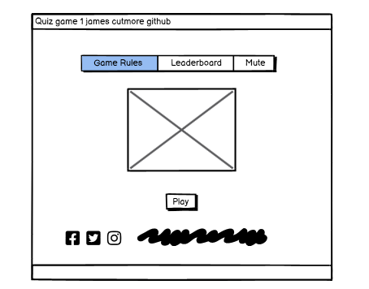
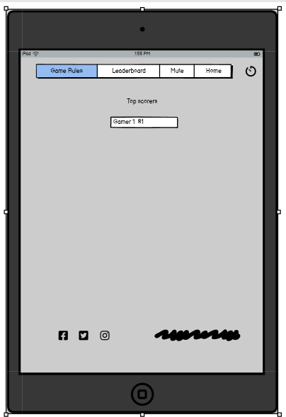
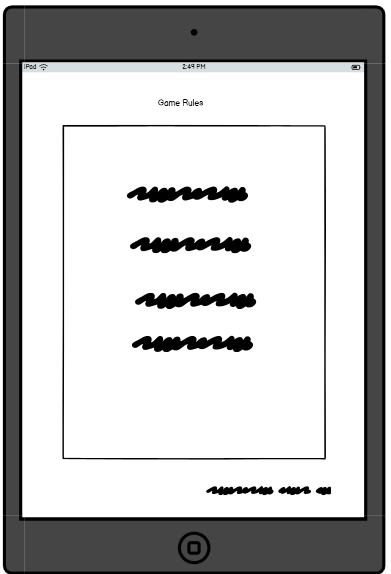

#                                            **Quiz-game1**
#                      Interactive Front-End Development Project using HTML,CSS and Javascript


#                                      James cutmore Quiz-game1-2023-MS2
A live website can be found [here](https://jamesrcutmore.github.io/Quiz-game1/)
## **Table of Contents**

  + [About](#about)
  + [Users Experience(UX)](#users-experience)
  + [Project Goals](#project-goals)
  + [Target Audience](#target-audience)
  + [User Stories](#user-stories)
  + [Design](#design)
  + [Wireframe](#wireframe-views)
  + [Features](#Features)
  + [Existing Features](#existing-features)
  + [Features Left to Implement](#features-left-to-implement)
  + [Technologies-Used](#Technologies-Used)
  + [Testing](#testing)
  + [Deployment](#Deployment)
  + [Credit](#Credit)
  + [Content](#content)
  + [Media](#media)
  + [Acknowledgements](#acknowledgements)

  # **About** 
+ Everyone loves a quiz?! The fun way to fill your spare time and keep you and your family entertained!

+ This quiz in perticular is based on the scinece, how much do you really know? Take a little time complete the quiz, and you will find out!

+ This Quiz is designed to include a wide range of randomised questions , all based on science , At the end , you will get the chance to save you score on the leadrboard and try again.. Have fun!

## **Users Experience (UX)**

### **Project Goals**

- The primary goal of this project is to set up a quiz game or knowledge checker ,for the players that may become a brief    assessment to measure their science knowledge
- The secondary goal is to help the user get their thinking mind on,improve short-term memory and sharpen their knowledge of general science.

### **Target Audience**

- This quiz is aimed at any age bracket or audience.

- The quiz is aimed at anybody who likes to test there science knowledge.

- The best way to promote our quiz game is through online advertisements and social media shares.

# **Users Stories**

 **General User Goals**
 - I want to be able to easily navigate through the 
   site easily

 - I want to find quiz related activities, so that it 
  broadens my knowledge and understanding.

 - I want o be able to test my knowledge

 - I want to find a quiz, so that I can have fun and 
   learn with.

- As a Quizzer, I want to find interesting games, so 
  that I can spend time, and enjoy enjoying playing them.

- As a learner , I want to learn through games, so 
  that I can gain knowledge and idea's.

- As a person who likes to be challenged, I want to find a challenging Quiz, so that I can test myself.

- As a Quiz competitor, I want to beat my last score ,when it is shown at the end.

- As a I-phone user, I want an app that is easy to use and is mobile friendly, so that I can use it on my mobile.

 # First Time Visitor Goals
- As a First Time Visitor, I want to easily understand the main purpose of the site and learn more about how to play the game.

- As a First Time Visitor, I want to be able to easily navigate throughout the site to give the game a try,and easily return to the home page.

- As a First Time Visitor, I want to know about the developer and their social media links.

 **Returning Visitor Goals**

- As a Returning Visitor, I want to be able to save my score and  so i can progress.

- As a Returning Visitor, I want to see if i can beat 
  my previous score.

- As a returning visitor i want to know that the site is easy to navigate,save my score and easily navigate through the site.

# **Design**

+ **Colour Scheme** 

      - I wanted to keep it colorful and fun!
  
      - Bright  primary colours so to make it easy and fun to navigate.


  
+ **Typography**

  The main font throughout the quiz is Josefin Sans with a back up font of sans-serif.Here we used google fonts.
  [Google Fonts](https://fonts.google.com/)

+ **Imagery**
  The imagery for the quiz game is simple colouful and pleasing on the eye. The navigation buttons are bright primary colour's with 3D effect movement with the hover over.
  - [Pixabay](https://pixabay.com/)

  - [google images](https://www.google.com/imghp?hl=en/)


   ---
 # **Sitemap**

 - The site is easy to navigate functional and responsive


   
 # **Wireframe views**




---

# **Wireframe Tablet view**





---

# **Wireframe Mobile view**


---
---

### **Features**

# **Existing Features**

Homepage whiche ntails navigation for game rule, mute button and leadrerboard. 

You press play then the music starts which can be muted.

you will have 90 seconds to answer all 20 questions.

Multiple-choice section - gives the users four choices they can choose from.

Once you've made all 20 choices a submit button should be pressed.

You will be prsented with a pop up message to indicate you have saved your score.

once the game is finished it will shows the final score.

 A play again button will then be presented.

### **Features Left to Implement**
 A background image faded into background.
 More thoght into the colour scheme.
---


# **Languages Used**
- Javascript
- H.T.M.L
- C.S.S

# **Technologies Used**
[Local strorage](https://www.w3schools.com/jsref/prop_win_localstorage.asp)
 - Local storage was used to save score

[The Trivia API](https://the-trivia-api.com/)

- A trivia api was used to change question and keep the player interested.

 [HTML5](https://en.wikipedia.org/wiki/HTML#:~:text=The%20HyperText%20Markup%20Language%2C%20or,displayed%20in%20a%20web%20browser.)

- The language used to give the site its main structure and all necessary features.

[CSS3](https://en.wikipedia.org/wiki/CSS)

- The language used to give the application its visual effects including the font, color and layout etc.

 [Javascript](https://developer.mozilla.org/en-US/docs/Web/JavaScript)

- The language used to implement the site's interactive features, allow the users to be interactive and make actions during their visit.

  ---
  ---


 # **Frameworks, Libraries & Programs Used**

[API's](https://the-trivia-api.com/)
The trivia API.com was used for randomized quiz questions

[VScode](https://code.visualstudio.com/)

Visual Studio Code has been used as a local code editor for write and manage all codes and files.

[Github](https://github.com/)

Github is used to create, store and maintain all codes in a repository.

Github is also used as the site hosting service for the final website to be published on.

[Git Version control](https://git-scm.com/)

 Git 2.31.1 for Mac is used for commit and push codes to Github.

[Google Fonts](https://fonts.google.com/)

The font used on this quiz were chosen from Google fonts.

[coolors](https://coolors.co/)

Insperation was gained from coolors pallete.

[Balsamiq](https://balsamiq.com/)

  The wireframes were created using Balsamiq.

 [Google DevTools](https://developer.chrome.com/docs/devtools/)

   Google DevTools was extensively used throughout the project for various styling, testing and debugging purposes.

 [Am I Responsive](http://ami.responsivedesign.is/)

   Am I responsive has been used to test the responsiveness of the site and also to create the mock-up image presented at the start of this document.

[W3C Markup Validation service](https://validator.w3.org/)

   W3C Markup Validation Service has been used to test the HTML codes.

 [W3C CSS Validation Service](https://jigsaw.w3.org/css-validator/)

   W3C CSS Validation Service has been used to test the CSS codes.

   ---
   

# **Testing**

## Manually Testing Functionality
### Navigation Buttons
+ Went to each page individually and clicked each button to make sure that they navigate to the correct place.
+ Went to each page individually on desktop and hovered over each button to make sure that the ```:hover``` class is applied to all.
+ Went to each page individually on mobile and made sure ```:hover``` isn't applied.
### Home Button
+ Home buttton tested and working correctley.
### Play Again
+ Play again button tested and worked as expected. 
### Mute Button
+ Changed the mute button to on/off several times in one game to check for any issues, checking for both right and wrong answers. 
### Questions
+ Played several games to make sure that all questions were populating correctly. 
+ ### Quiz API
+ Started quiz several times to make sur api question where loading and functioning correctly.
### Answer Buttons
+ checked several games to make sure that all answers were populating correctly inside their buttons. 
+ Checked several games to make sure that all answers were populating for the correct question.
+ Made sure pop up appears if you do not select a question before you submit. 
 
### Heads Up Display
+ Made sure that if the answer is chosen, the score increments. 
+ Made sure that if the wrong answer is chosen, the score doesn't increment. 
+ Made sure that, regardless of right or wrong answer being chosen, the question number increments. 
### Submit Score
+ Added name to input field and submitted to check submit was working. 
### Saved Scores
+ Checked to make sure name and score were  saving in the local storage correctly.
+ Made sure that correct name and score were being added.   
+ Shut down device and restarted to make ensure that scores were being saved in local storage. 
`Home Page`

| Feature | Expected Outcome | Testing Performed |  Actual Result | Outcome |
| --- | --- | --- | --- | --- |
| The Sites title | Link directs the user back to the home page | Clicked title |  page reloads | Pass |
| Game rules button | Displays the instructions on how to play the game | Clicked on button |  instructions on how to play opens | Pass |
|close button | Closes the message box | Clicked on close button | boxclosed | Pass |
| Play Button | Tkaes you to play the game | Clicked on button | Game page opens to questions | Pass |
| Save Scores input Button | Asks for you to save your score | Clicked on button | Name inputed | Pass |
| All buttons - hover effect | All buttons have hovered over with movement. | Hover over each button on the page |button movenment correctly performing  when hovered over | Pass |
|  Cursor pointer| cursor displayed when moved over buttons |  mouse  positionedover each button to check the cursor changed  | cursor changed when hoverd | Pass |
| Mute Button | Gives player the choice to have music or not | Clicked on button | muted impliment | Pass |
| unmute Button | Gives player the choice to have music unmuted | Clicked on button | unmuted impliment | Pass |
---
# Automatic testing

### Validation
+ I used the W3C Markup Validation Service on all pages sceins quizes pages. I also validated the my  style.css with the CSS Validator.

+ JS Hint was used to validate javascript.


# **Deployment**

### **Deploy To GitHub Pages**

1. Logged into Github account.

2. Select repository.

3. Select Jamescutmore-Quizgame1.

4. On the top right navigation click on settings.

5. Under the settings section, scroll down to the GitHub Pages section.

6. Select Main Branch from the source dropdown menu.

7. Click save.

8. Once clicked, this publishes the project to GitHub Pages and displays the site URL. Click on the URL to view the live site.

### **Making a clone or download zip to run locally**

1. Log into GitHub account.

2. Select repository.

3. Select jamescutmore/Quiz-game1: quiz game ms2

4. Click on the Code dropdown button next to the green Gitpod button.

5. Click on the clipboard icon to copy the clone URL.

6. Open Git Bash.

7. Change the current working directory to the location where you want the cloned directory.

8. Type "git clone" in the Command Line and then paste the URL copied in step 5.

9. Press enter to create your local clone.

10. Alternately, click on Download ZIP, unpack locally and open with a local code editor.

### **Forking the GitHub Repository**

1. Log into GitHub.

2. Select repository.

3. Select jamescutmore/Quizgame1

4. At the very top right corner click "fork".

5. You will have a copy of the original repository in your own GitHub account.

# **Credits**

### **Content**

Throughout the process of doing this project I have done a lot from searching and investigating. All resources are referenced in the credits and the codes section below. 

 # Codes

   [w3schools](https://www.w3schools.com/) - [audio](https://www.w3schools.com/html/html5_audio.asp), [javascript modal](https://www.w3schools.com/howto/howto_css_modals.asp), [loader](https://www.w3schools.com/howto/howto_css_loader.asp), [cubic-bezier](https://www.w3schools.com/cssref/func_cubic-bezier.asp), [javascript objects](https://www.w3schools.com/js/js_objects.asp), [setInterval and clearInterval](https://www.w3schools.com/jsref/met_win_setinterval.asp), [setTimeout](https://www.w3schools.com/js/js_timing.asp), [Array splice](https://www.w3schools.com/jsref/jsref_splice.asp), [DOM changing CSS](https://www.w3schools.com/js/js_htmldom_css.asp), [JSON.parse()](https://www.w3schools.com/js/js_json_parse.asp), [Math.floor()](https://www.w3schools.com/jsref/jsref_floor.asp), [CSS background-image](https://www.w3schools.com/cssref/pr_background-image.asp), [CSS box-shadow](https://www.w3schools.com/cssref/css3_pr_box-shadow.asp), [Array map()](https://www.w3schools.com/jsref/jsref_map.asp)

   [stackoverflow](https://stackoverflow.com/) - [display options randomly](https://stackoverflow.com/questions/53362187/javascript-quiz-display-random-options), [difference between innerText and innerHTML](https://stackoverflow.com/questions/19030742/difference-between-innertext-innerhtml-and-value), [convert an object key value into an array](https://stackoverflow.com/questions/38824349/how-to-convert-an-object-to-an-array-of-key-value-pairs-in-javascript)

   [MDN Web Docs](https://developer.mozilla.org/en-US/docs/Web/JavaScript/Reference/Global_Objects/Math/max) - [Math.max()](https://developer.mozilla.org/en-US/docs/Web/JavaScript/Reference/Global_Objects/Math/max), [window.location.assign()](https://developer.mozilla.org/en-US/docs/Web/API/Location/assign), [window.localStorage](https://developer.mozilla.org/en-US/docs/Web/API/Window/localStorage), [Array.prototype.join()](https://developer.mozilla.org/en-US/docs/Web/JavaScript/Reference/Global_Objects/Array/join), [Element.classList](https://developer.mozilla.org/en-US/docs/Web/API/Element/classList), [parseInt()](https://developer.mozilla.org/en-US/docs/Web/JavaScript/Reference/Global_Objects/parseInt), [Spread syntax](https://developer.mozilla.org/en-US/docs/Web/JavaScript/Reference/Operators/Spread_syntax), [forEach](https://developer.mozilla.org/en-US/docs/Web/JavaScript/Reference/Global_Objects/Array/forEach), [Fetch API](https://developer.mozilla.org/en-US/docs/Web/API/Fetch_API)

   [7 Methods for Comparing Arrays in JavaScript](https://javascript.plainenglish.io/7-methods-for-comparing-arrays-in-javascript-88f10c071897)

 User Experience

   [How To find your Target audience..Adam Erhart..](https://youtu.be/FzEkHlYt2uA/)

   [How to write a good user story](https://stormotion.io/blog/how-to-write-a-good-user-story-with-examples-templates/#.YFM57o-2eQY.linkedin)

### **Media**

 Images

   The main image for the quiz is the Qeustion an the multible choice of answers.
   Also there is a submit button to press once youve made your choice.


### **Acknowledgements**

I would like to thank:

My mentor Antonio Rodriguez for his encouragement and patience when my frustration kicked in at the start of this project. Thanks to his guidence and tips, I have gotten over the dip and made it to the end.

Help and support from fellow students in the Slack community.

Tutor support and student care team.

 My wife Lyndsay cutmore support and help with testing and encouragement.

Should you have any queries please reach me on rob_cutmore@hotmail.com